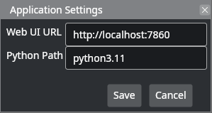
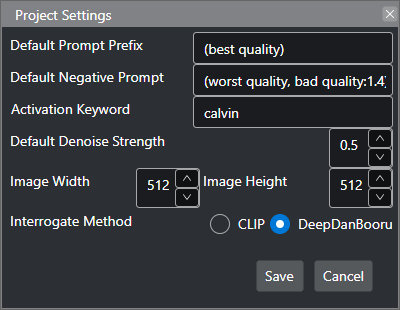
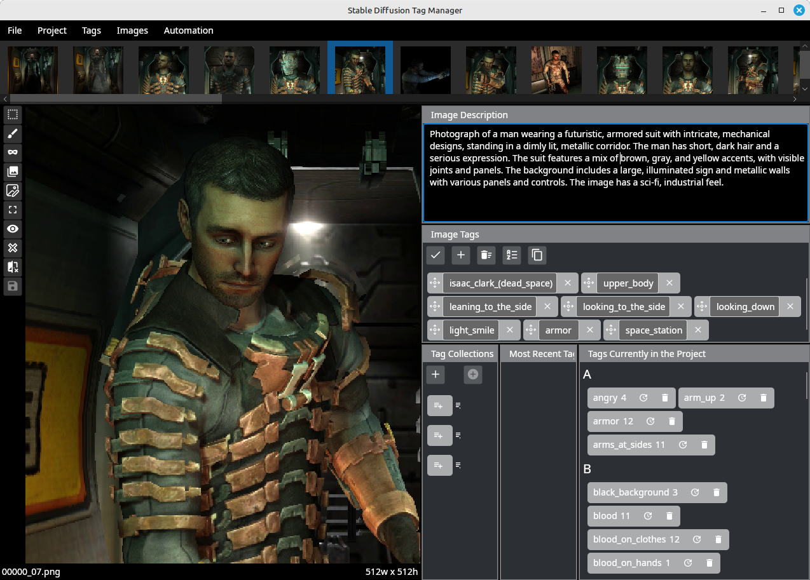
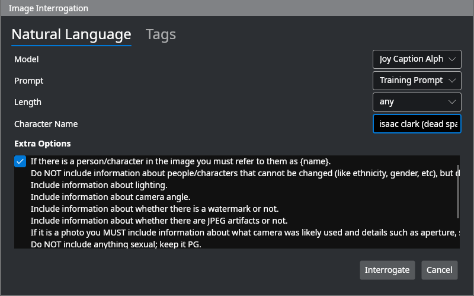

# Stable Diffusion Tag Manager

Stable Diffusion Tag Manager is a simple desktop GUI application for managing an image set for training/refining a stable diffusion (or other) text-to-image generation model.  The main goal of this program is to combine several common tasks that are needed to prepare and tag images before feeding them into a set of tools like [these scripts](https://github.com/kohya-ss/sd-scripts) by [kohya-ss](https://github.com/bmaltais/kohya_ss).

## Prequisites

Stable Diffusion Tag Manager is a stand alone application with no prequisites to launch the application on linux, osx, and windows. However, much of it's functionality relies on other projects that utiliize python. Currently in order to use these features you must have python 3.11 installed. 
The following features require python 3.11:

- Mask generation with YOLO models.
- Masked area removal with LaMa.
- Image interrogation.
- Comic book panel extraction with the [kumiko](https://github.com/njean42/kumiko) library by [njean42](https://github.com/njean42).

Keep in mind that for many of these features the application will need to create a python venv, install libraries, and download models so the first time they're used it can take a while to initialize everything.

Additionally the following features also have external dependencies:
- Touchup via stable diffusion rely on a running instance of [Automatic1111's](https://github.com/AUTOMATIC1111) [stable diffusion webui](https://github.com/AUTOMATIC1111/stable-diffusion-webui) or [lllyasviel's](https://github.com/lllyasviel) [Forge](https://github.com/lllyasviel/stable-diffusion-webui-forge) that can be reached from the local system.
- RemBG requires having the rembg extension inside of the stable diffusion webui instance you're pointing to. I intend to remove this dependency eventually and just run it locally through python.

## Building the project

The project is currently developed in Visual Studio 2022. Building it is pretty straightforward. 

- Clone the repo
- Get the latest submodules by executing the command `git submodule update --init --recursive` in the repo root (this is for kumiko).
- Build the solution `src/StableDiffusionTagManager.sln`.

## Running the application without building

Grab the corresponding release for your supported os [here](https://github.com/PMahern/StableDiffusionTagManager/releases). Then you'll need to extract the archive to whatever folder you want the application in. From there there's different steps based on which os you're running.

### Windows
You simply need to run the StableDiffusionTagManager.exe executable, you may have to go to the exe's properties and uncheck the checkbox indicating the file was downloaded from the internet. Windows smartscreen may pop up telling you the file is unsafe, unfortunately the way for me to get around this is to buy a quite expensive code signing certificate which I'm not willing to do at present.

### Linux
You'll need to add the execute permission to the StableDiffusionTagManager file (which is the executable). This can be done by running _sudo chmod +x StableDiffusionTagManager_ in a terminal window in the directory of the extracted  archive. After granting the execute permission you can run the application in the command line by running _./StableDiffusionTagManager_ or you can create a shortcut for it.

### Mac
On Mac it's a bit more tedious of a process, you need to remove the com.apple.quarantine attribute from several files in the archive's publish folder and then you can run StableDiffusionTabManager file either via a shortcut or running _./StableDiffusionTagManager_. The files you need to remove this attribute from are the following: StableDiffusionTagManager, libSkiaSharp.dylib, libHarfBuzzSharp.dylib, and libAvaloniaNative.dylib. The commands would look like the following:
<!--  -->
_xattr -d com.apple.quarantine StableDiffusionTagManager_

_xattr -d com.apple.quarantine libSkiaSharp.dylib_

_xattr -d com.apple.quarantine libHarfBuzzSharp.dylib_

_xattr -d com.apple.quarantine libAvaloniaNative.dylib_

## Usage

Users can load a folder of images with corresponding tag files, when a folder is opened for the first time they will be prompted to create a project. Projects are not a requirement but allow some settings that are global to the image set.

## Application Settings

In the file menu you can find a settings option that allows you to specify some global settings. The first is the web address of the stable diffusion webui/forge server you intend to use for inpainting (if you plan to use it), the second option is a fair bit more important, it's the executable for python 3.11 installed on your local system. Several features rely on the python path setting so make sure it's right!
## Projects

Projects allow you to specify settings to help expedite certain tasks. The default prompt prefix will add the entered text as a prefix to the tags currently defined on an image when opening the image touch up window. The default negative prompt and denoise stregth will be automatically entered into their respective fields on the touch up screen. The image size setting specifies a size for images to crop to when using a special crop option, with the intent that eventually all images in the set will be resized to the same size since models tend to train better if the images are all the same size and match the size the original base model was trained on (such as 512x512 pixels for stable diffusion 1.5 or 1024x1024 on SDXL).

After loading your image set you'll be presented with the following layout.

Across the top are the images in the set and on the right are the natural language description and tags for the currently selected image. On the left is an image viewer with the currently selected image and some simple controls for manipulating the image.

## The Image Viewer 

## Image editing/cropping

The image viewer itself has some tools for simple editing of the image. It's not meant to replace photoshop or paint.net but it gives you a place to quickly tweak images in your dataset without having to go to another application.

Selection mode allows you to select an area in the image for cropping to a new image, you can crop to the target size 
 specified in the project settings or just crop the selection to it's pixel width and height  . You can also   lock the aspect ratio of the selection which will persist between images, this will allow you to always ensure your selection area is a square, for instance.

Paint mode allows you to pick a brush size and color and then paint over the image. It's only meant for quick and dirty painting, typically just covering something up in the image that you don't want going into the model you're training.

Comic panel extraction via kumiko can be done with the  button. After the process runs you will be presented with a new window that shows you the comic panels it detected, you can click the check box on the corner of each image you want to keep.

## Image Interrogation

Currently the application implements/uses the following image interrogators:
 -  [Fancy Feast's](https://huggingface.co/fancyfeast) Joy Caption (Pre-Alpha, Alpha One, and Alpha Two)
 -  [Smiling Wolf's](https://huggingface.co/SmilingWolf) booru tag generators
 -  [CogVLM2](https://huggingface.co/THUDM/cogvlm2-llama3-chat-19B) (Linux only unfortunately due to Triton not being available elsewhere)

You can specify both a Natural Language and Tag interrogator to populate both fields for an image, there's also an option under the Automation menu to do all the images in the entire set.

## Mask Generation

While in mask mode you can use YOLO to generate a mask for the image. The application will look for a "yolomodels" folder in the root directory for models.  Currently masking is only used for passing a mask to LaMa for removing things from the current image. There is a batch process under the Automation menu that will run YOLO mask generation for every image then pass the mask with the image to LaMa to remove the masked areas. 

### Image "Touch up"

After clicking the  button a new window will popup which will allow you to feed the image into AUTOMATIC1111's stable diffusion webui and pick a new version. It has a limited set of inputs you can feed into the inpaint function, it's not meant to replace the full set of functions currently already available in stable diffusion webui's interface. If there's any missing inputs that seem like they should be added feel free to suggest!

Probably not the best example, but the intent is that you can fix up images before using them to train, removing elements like speech bubbles or other characters from the scene.

## Manual Tagging

Upon startup, the application will look for a tags.csv in the folder where the exe lies. It expects a csv with two columns, the first being a tag name and the second being a number. It will order the tags in descending order and use these 
as autocomplete suggestions anywhere you might type a tag. One such example file can be found [here](https://github.com/stmobo/Machine-Learning/blob/master/danbooru-chars.csv).

It's usually best to try and use the interrogate function to generate an initial description and set of tags. It hallucinates a lot of tags but you can quickly trim the excess ones and it often times may spot things you didn't think to add. After getting an initial set of tags there are several hotkeys to help with the extremely tedious process of tagging.

- Shift + enter will add a tag in front of the currently focused tag (or at the front of all the tags if none is selected).
- Shift + up will add a tag to the beginning of the current tag set
- Shift + down will add a tag to the end of the current tag set
- Ctrl + left or right will move the currently focused tag left or right
- Shift + , or . will move between images in the set
- Shift + delete will delete the currently focused tag
- Ctrl + delete will delete the currently selected image (with a warning)

### Thanks

This project wouldn't be possible without the awesome Avalonia ui library and the aforementioned other libraries and tools. I also grabbed the base source code for the image viewer control from the [UVtools library](https://github.com/sn4k3/UVtools).
